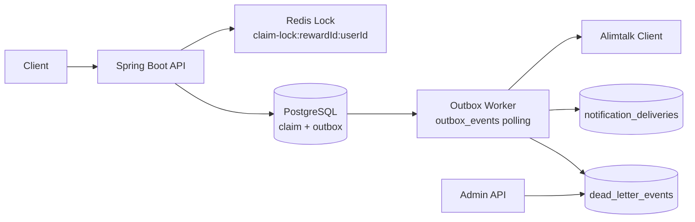
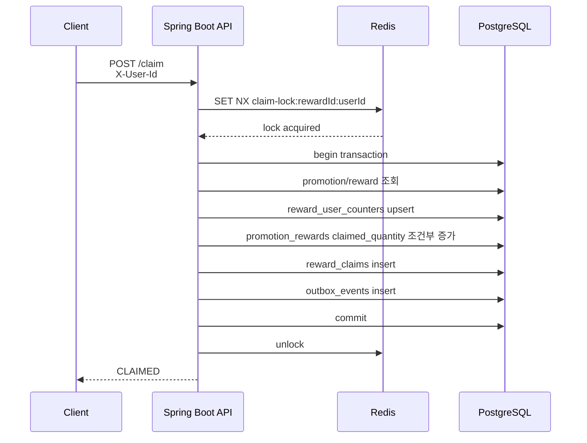
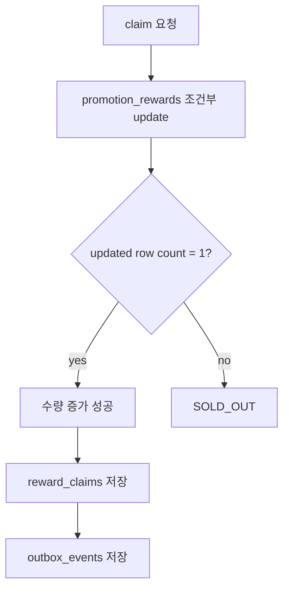
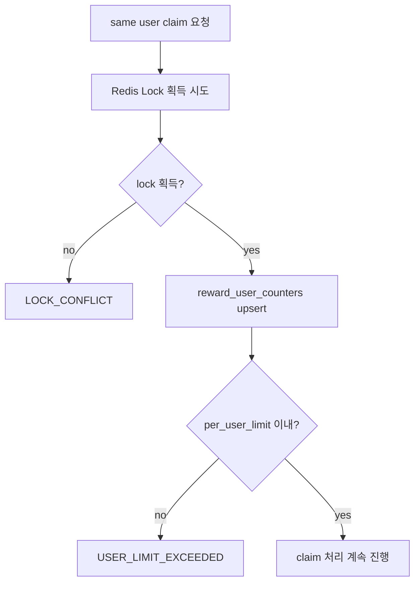
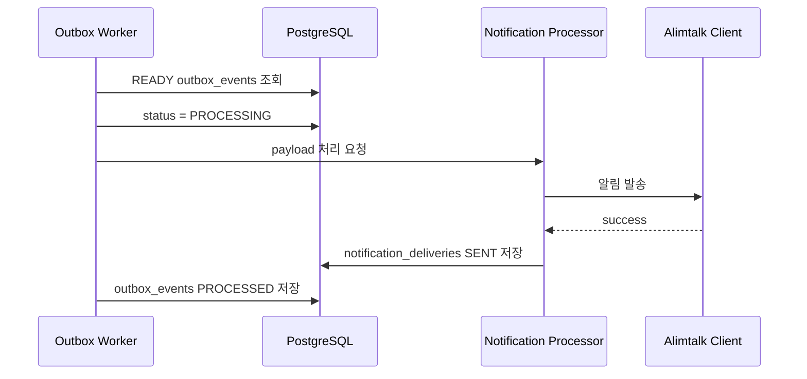
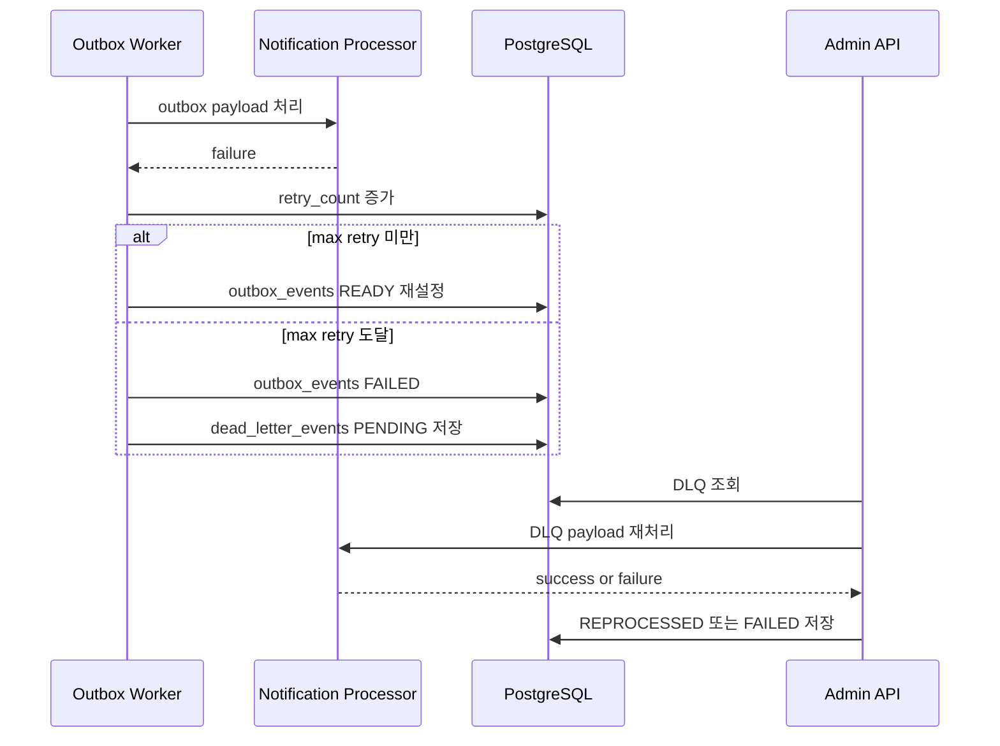
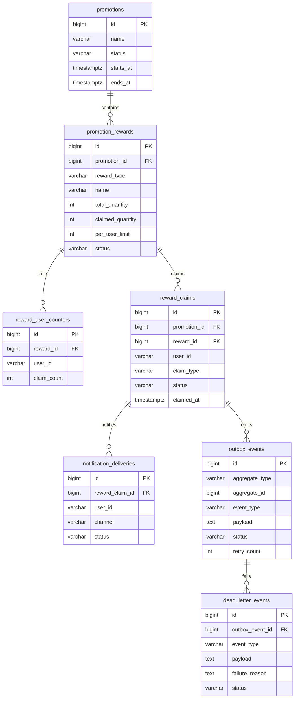

# PromoGuard

PromoGuard는 선착순 쿠폰 발급과 경품 응모를 안전하게 처리하는 프로모션 MVP입니다.

핵심 목표는 “많은 사용자가 동시에 요청해도 정해진 수량만 성공하고, 같은 사용자의 중복 발급/응모는 막으며, 성공 이후 알림 처리 실패는 DLQ에 보관하고 재처리할 수 있는 시스템”입니다.

하나의 프로모션에는 여러 보상(`promotion_rewards`)을 둘 수 있습니다. 보상은 쿠폰(`COUPON`)일 수도 있고, 경품 응모권(`RAFFLE_ENTRY`)일 수도 있습니다. 각 보상은 전체 수량과 사용자별 참여 가능 횟수를 독립적으로 가집니다.

## 주요 기능

- 프로모션 생성
- 프로모션 하위 보상 생성
- 선착순 쿠폰 발급
- 경품 응모 처리
- 전체 수량 초과 claim 방지
- 사용자별 중복 claim 방지
- Redis Lock 기반 동일 사용자 동시 요청 제어
- claim 성공 이벤트를 Outbox에 저장
- Outbox Worker를 통한 알림 처리
- 알림 실패 시 DLQ 저장
- DLQ 조회 및 재처리 API
- 1,000건 동시 요청 통합 테스트

## 전체 구조



발급/응모 요청은 Spring Boot API에서 처리합니다. 동일 사용자의 같은 보상 요청은 Redis Lock으로 먼저 제어하고, 실제 수량과 사용자별 횟수는 PostgreSQL의 원자적 update/upsert로 보장합니다.

claim 성공 후에는 바로 외부 알림 API를 호출하지 않고 `outbox_events`에 성공 이벤트를 저장합니다. Outbox Worker가 이 이벤트를 읽어 알림을 처리하고, 반복 실패한 이벤트는 `dead_letter_events`로 이동합니다.

## 아키텍처 구성 요소

### Client

사용자는 프로모션 보상 claim API를 호출합니다. 서버는 `X-User-Id` 헤더로 사용자를 식별합니다.

```http
POST /api/promotions/{promotionId}/rewards/{rewardId}/claim
X-User-Id: user-1
```

### Spring Boot API

프로모션 생성, 보상 생성, 보상 claim, DLQ 조회/재처리 API를 제공합니다.

claim 요청에서는 다음 책임을 가집니다.

- 프로모션과 보상 존재 여부 확인
- 프로모션 기간 확인
- 보상 활성 상태 확인
- 동일 사용자 동시 요청 lock 획득
- 사용자별 claim 횟수 증가
- 전체 claim 수량 증가
- claim 이력 저장
- Outbox 이벤트 저장

### Redis

Redis는 동일 사용자의 같은 보상 동시 요청을 빠르게 제어하는 lock 저장소로 사용합니다.

```text
claim-lock:{rewardId}:{userId}
```

예를 들어 `same-user`가 `rewardId=1` 보상에 동시에 100번 요청하면, 하나의 요청만 lock을 획득하고 나머지는 `LOCK_CONFLICT`로 빠르게 실패할 수 있습니다.

### PostgreSQL

PostgreSQL은 최종 정합성을 책임집니다.

- `promotion_rewards`: 전체 수량과 현재 claim 수량 관리
- `reward_user_counters`: 사용자별 claim 횟수 관리
- `reward_claims`: 실제 claim 이력 저장
- `outbox_events`: claim 성공 이벤트 저장
- `notification_deliveries`: 알림 처리 이력 저장
- `dead_letter_events`: 반복 실패 이벤트 저장

### Outbox Worker

`outbox_events`에서 처리 가능한 이벤트를 주기적으로 조회합니다.

조회한 이벤트는 `PROCESSING`으로 바꾼 뒤 알림 처리를 시도합니다. 성공하면 `PROCESSED`, 실패하면 retry count를 증가시키고 다시 `READY`로 돌리거나 최대 재시도 횟수 이후 `FAILED`로 변경합니다.

### Notification Processor

Outbox payload를 `RewardClaimedEvent`로 역직렬화하고 알림 클라이언트를 호출합니다.

성공하면 `notification_deliveries`에 `SENT` 이력을 저장하고, 실패하면 `FAILED` 이력을 저장한 뒤 예외를 다시 던져 Outbox Worker가 재시도 또는 DLQ 이동을 판단하게 합니다.

### DLQ API

반복 실패한 이벤트를 조회하고 재처리합니다.

```http
GET /api/admin/dlq/events?status=PENDING
POST /api/admin/dlq/events/{eventId}/retry
POST /api/admin/dlq/events/retry-next
```

## 주요 플로우

### Claim 성공 플로우



이 플로우에서 중요한 점은 `reward_claims`와 `outbox_events`가 같은 트랜잭션에 저장된다는 것입니다. claim 성공 이벤트가 유실되지 않도록 하기 위한 구조입니다.

### 전체 수량 초과 방지 플로우



전체 수량은 Redis가 아니라 PostgreSQL 조건부 update로 최종 보장합니다.

```sql
update promotion_rewards
set claimed_quantity = claimed_quantity + 1
where id = :rewardId
  and status = 'ACTIVE'
  and claimed_quantity < total_quantity
```

동시에 1,000건이 들어와도 update 조건을 만족한 요청만 성공하고, 수량을 초과한 요청은 update row count가 `0`이 되어 `SOLD_OUT`으로 처리됩니다.

### 동일 사용자 중복 요청 방지 플로우



Redis Lock은 동일 사용자의 동시 요청을 빠르게 거절합니다. 사용자별 제한의 최종 판단은 `reward_user_counters`의 upsert 조건이 담당합니다.

### Outbox 알림 처리 플로우



claim API는 알림 발송 완료를 기다리지 않습니다. claim 성공 이벤트를 DB에 저장한 뒤 응답하고, 알림은 worker가 비동기로 처리합니다.

### DLQ 플로우



DLQ는 계속 실패하는 이벤트를 정상 outbox 처리 흐름에서 분리하기 위한 구조입니다. 운영자는 실패 원인을 확인한 뒤 DLQ API로 재처리할 수 있습니다.

## 기술 선택 이유

### PostgreSQL 원자 업데이트

전체 수량 초과 발급을 막는 최종 방어선은 DB입니다. `promotion_rewards.claimed_quantity`를 조건부 update로 증가시키고, update된 row 수가 `1`일 때만 claim 성공으로 처리합니다.

```sql
update promotion_rewards
set claimed_quantity = claimed_quantity + 1
where id = :rewardId
  and status = 'ACTIVE'
  and claimed_quantity < total_quantity
```

이 방식은 동시에 많은 요청이 들어와도 DB가 `claimed_quantity < total_quantity` 조건을 기준으로 초과 발급을 막습니다.

### 사용자별 Counter

쿠폰은 사용자당 1회, 경품 응모는 사용자당 5회처럼 보상마다 참여 제한이 다를 수 있습니다. 그래서 실제 이력인 `reward_claims`와 별도로 `reward_user_counters`를 둡니다.

`reward_user_counters`는 `(reward_id, user_id)` unique 제약과 upsert를 사용해 사용자별 참여 횟수를 안전하게 증가시킵니다.

```sql
insert into reward_user_counters (reward_id, user_id, claim_count)
values (:rewardId, :userId, 1)
on conflict (reward_id, user_id)
do update
set claim_count = reward_user_counters.claim_count + 1
where reward_user_counters.claim_count < :perUserLimit
```

### Redis Lock

같은 사용자가 같은 보상에 대해 거의 동시에 여러 요청을 보내는 경우를 빠르게 직렬화하기 위해 Redis Lock을 사용합니다.

Lock key 형식은 다음과 같습니다.

```text
claim-lock:{rewardId}:{userId}
```

Redis Lock은 DB 부하와 충돌을 줄이는 보조 장치입니다. 최종 정합성은 DB 원자 업데이트, upsert, unique 제약이 보장합니다.

### Transactional Outbox

발급/응모 성공과 알림 이벤트 저장은 같은 DB 트랜잭션 안에서 처리합니다.

```text
transaction
  - reward_user_counters 증가
  - promotion_rewards 수량 증가
  - reward_claims 저장
  - outbox_events 저장
commit
```

이 구조를 사용하면 claim은 성공했는데 알림 이벤트가 사라지는 상황을 줄일 수 있습니다. 알림 발송은 외부 API에 의존하므로 claim 트랜잭션에서 직접 처리하지 않고, `outbox_events`에 남긴 뒤 별도 worker가 처리합니다.

### DB 기반 DLQ

알림 발송은 외부 API timeout, 템플릿 오류, 잘못된 수신자 정보 등으로 실패할 수 있습니다. 실패 이벤트를 무한 재시도하면 정상 이벤트 처리까지 지연될 수 있으므로, 일정 횟수 이상 실패한 이벤트는 `dead_letter_events`에 격리합니다.

운영자는 DLQ API로 실패 이벤트를 조회하고 재처리할 수 있습니다.

## ERD



## 주요 테이블

`promotions`는 프로모션 자체를 저장합니다. 프로모션명, 상태, 시작/종료 시간을 가집니다.

`promotion_rewards`는 프로모션 안의 쿠폰, 경품 응모권 같은 보상을 저장합니다. 전체 수량, 현재 claim 수량, 사용자별 제한 횟수를 가집니다.

`reward_user_counters`는 사용자별 claim 횟수를 저장합니다. 사용자당 1회 쿠폰 발급과 사용자당 5회 경품 응모를 같은 방식으로 처리하기 위한 테이블입니다.

`reward_claims`는 실제 발급/응모 이력입니다. 어떤 사용자가 어떤 보상을 언제 claim했는지 저장합니다.

`outbox_events`는 외부로 전달해야 할 성공 이벤트를 저장합니다. 현재는 Outbox Worker가 이 테이블을 polling해서 알림 처리를 수행합니다.

`notification_deliveries`는 알림 발송 성공/실패 이력을 저장합니다.

`dead_letter_events`는 반복 실패한 알림 이벤트를 보관합니다.

## API

### 프로모션 생성

```http
POST /api/promotions
Content-Type: application/json

{
  "name": "launch promotion",
  "startsAt": "2026-01-01T00:00:00Z",
  "endsAt": "2030-12-31T23:59:59Z"
}
```

### 보상 생성

```http
POST /api/promotions/{promotionId}/rewards
Content-Type: application/json

{
  "rewardType": "COUPON",
  "name": "10% coupon",
  "totalQuantity": 100,
  "perUserLimit": 1
}
```

`rewardType`은 `COUPON`, `RAFFLE_ENTRY`를 지원합니다.

### 보상 조회

```http
GET /api/promotions/{promotionId}/rewards/{rewardId}
```

### 발급/응모 요청

```http
POST /api/promotions/{promotionId}/rewards/{rewardId}/claim
X-User-Id: user-1
```

성공 응답:

```json
{
  "status": "CLAIMED",
  "claimId": 1,
  "rewardType": "COUPON",
  "message": "Reward claimed"
}
```

주요 실패 코드:

```text
LOCK_CONFLICT
USER_LIMIT_EXCEEDED
SOLD_OUT
PROMOTION_NOT_OPEN
REWARD_NOT_ACTIVE
REWARD_NOT_FOUND
```

### DLQ 조회 및 재처리

```http
GET /api/admin/dlq/events?status=PENDING
POST /api/admin/dlq/events/{eventId}/retry
POST /api/admin/dlq/events/retry-next
```

DLQ 상태는 `PENDING`, `REPROCESSED`, `FAILED`를 사용합니다.

## 실행

README와 설정 파일에 있는 DB 계정/비밀번호는 로컬 개발과 데모 실행을 위한 기본값입니다. 운영 환경에서는 `DB_URL`, `DB_USERNAME`, `DB_PASSWORD`, `REDIS_HOST`, `REDIS_PORT` 같은 환경변수로 별도 값을 주입합니다.

### Docker Compose로 PostgreSQL/Redis 실행

Docker Compose로 실행하는 PostgreSQL은 로컬 PostgreSQL과 충돌하지 않도록 `localhost:15432`를 사용합니다. Redis는 `localhost:6379`를 사용합니다.

```bash
docker compose up -d
```

컨테이너 상태 확인:

```bash
docker compose ps
```

애플리케이션 실행:

```bash
./gradlew bootRun
```

기본 DB URL은 Docker Compose 기준입니다.

```text
jdbc:postgresql://localhost:15432/promoguard
```

### 로컬 PostgreSQL을 직접 사용할 때

로컬에 직접 설치된 PostgreSQL `5432`를 사용하고 싶다면 `DB_URL`을 지정해서 실행합니다.

```bash
DB_URL=jdbc:postgresql://localhost:5432/promoguard ./gradlew bootRun
```

계정이 다르면 아래처럼 함께 지정합니다.

```bash
DB_URL=jdbc:postgresql://localhost:5432/promoguard \
DB_USERNAME=promoguard \
DB_PASSWORD=promoguard \
./gradlew bootRun
```

## 테스트

### 테스트 구성

기본 테스트와 통합 테스트를 분리했습니다.

`test`는 외부 PostgreSQL/Redis 없이 실행되는 단위 테스트만 돌립니다.

```bash
./gradlew test
```

`localIntegrationTest`는 로컬 PostgreSQL과 Redis를 사용하는 통합 테스트만 돌립니다.

```bash
./gradlew localIntegrationTest
```

### 로컬 통합 테스트 환경

통합 테스트 기본값은 `src/test/resources/application-local-integration.yml`에 정의되어 있습니다.

```text
PostgreSQL: jdbc:postgresql://localhost:5432/promoguard
Redis: localhost:6379
```

로컬 통합 테스트는 개발자가 이미 띄워둔 로컬 PostgreSQL과 Redis를 사용합니다. PostgreSQL 계정과 DB가 없다면 먼저 생성해야 합니다.

```sql
create user promoguard with password 'promoguard';
create database promoguard owner promoguard;
```

Docker Compose PostgreSQL인 `localhost:15432`를 통합 테스트에 사용하고 싶다면 환경변수로 override합니다.

```bash
LOCAL_TEST_DB_URL=jdbc:postgresql://localhost:15432/promoguard \
LOCAL_TEST_DB_USERNAME=promoguard \
LOCAL_TEST_DB_PASSWORD=promoguard \
LOCAL_TEST_REDIS_HOST=localhost \
LOCAL_TEST_REDIS_PORT=6379 \
./gradlew localIntegrationTest
```

### 테스트 실행 결과

아래 명령으로 캐시 없이 재실행해 통과를 확인했습니다.

```bash
./gradlew test --rerun-tasks
./gradlew localIntegrationTest --rerun-tasks
```

검증 시각: 2026-06-22 07:50 KST

단위 테스트 결과:

```text
BUILD SUCCESSFUL
총 9개 테스트 통과

PromotionServiceTest: 3개
RewardClaimServiceTest: 4개
OutboxEventTest: 2개
```

로컬 통합 테스트 결과:

```text
BUILD SUCCESSFUL
총 3개 테스트 통과

RewardClaimConcurrencyIntegrationTest: 3개
```

통합 테스트는 각 테스트 전에 DB 테이블을 truncate하고, Redis의 `claim-lock:*` 키를 삭제합니다. 로컬 Redis를 공유하더라도 이전 테스트 실행에서 남은 lock key가 다음 테스트에 영향을 주지 않도록 하기 위함입니다.

### 동시성 테스트 결과

`RewardClaimConcurrencyIntegrationTest`는 실제 Spring Boot context, PostgreSQL, Redis를 사용합니다.

#### 서로 다른 사용자 1,000명 동시 요청

테스트명:

```text
claimsOnlyTotalQuantityWhenManyDifferentUsersRequestConcurrently
```

조건:

```text
요청 수: 1,000건
스레드 풀 크기: 100
보상 전체 수량: 100
사용자별 제한: 1회
사용자 ID: user-0 ~ user-999
```

검증 결과:

```text
CLAIMED: 100건
SOLD_OUT: 900건
promotion_rewards.claimed_quantity: 100
reward_claims 저장 수: 100
outbox_events 저장 수: 100
사용자별 최대 claim_count: 1
```

이 테스트는 전체 수량이 100개일 때 1,000명이 동시에 요청해도 100건만 성공하고, 나머지는 품절 처리되는지 확인합니다.

#### 동일 사용자 100건 동시 요청

테스트명:

```text
allowsOnlyOneClaimWhenSameUserRequestsConcurrentlyWithLimitOne
```

조건:

```text
요청 수: 100건
스레드 풀 크기: 50
보상 전체 수량: 100
사용자별 제한: 1회
사용자 ID: same-user
```

검증 결과:

```text
CLAIMED: 1건
나머지 요청: LOCK_CONFLICT 또는 USER_LIMIT_EXCEEDED
promotion_rewards.claimed_quantity: 1
reward_claims 저장 수: 1
same-user claim_count: 1
```

이 테스트는 같은 사용자가 동시에 여러 번 요청해도 하나만 성공하는지 확인합니다.

#### 경품 응모 사용자별 5회 제한

테스트명:

```text
allowsUpToPerUserLimitForRaffleEntry
```

조건:

```text
보상 타입: RAFFLE_ENTRY
보상 전체 수량: 100
사용자별 제한: 5회
사용자 ID: raffle-user
```

검증 결과:

```text
1~5번째 요청: CLAIMED
6번째 요청: USER_LIMIT_EXCEEDED
promotion_rewards.claimed_quantity: 5
reward_claims 저장 수: 5
raffle-user claim_count: 5
```

이 테스트는 쿠폰 발급뿐 아니라 경품 응모처럼 사용자별 여러 번 참여 가능한 보상도 같은 claim 구조로 처리할 수 있는지 확인합니다.

## 데모 시나리오

### 1. 프로모션 생성

```bash
curl -X POST http://localhost:8080/api/promotions \
  -H 'Content-Type: application/json' \
  -d '{
    "name": "launch promotion",
    "startsAt": "2026-01-01T00:00:00Z",
    "endsAt": "2030-12-31T23:59:59Z"
  }'
```

응답의 `id`를 이후 `{promotionId}`로 사용합니다.

### 2. 쿠폰 보상 생성

```bash
curl -X POST http://localhost:8080/api/promotions/1/rewards \
  -H 'Content-Type: application/json' \
  -d '{
    "rewardType": "COUPON",
    "name": "10% coupon",
    "totalQuantity": 100,
    "perUserLimit": 1
  }'
```

응답의 `id`를 이후 `{rewardId}`로 사용합니다.

### 3. 쿠폰 발급

```bash
curl -X POST http://localhost:8080/api/promotions/1/rewards/1/claim \
  -H 'X-User-Id: user-1'
```

예상 응답:

```json
{
  "status": "CLAIMED",
  "claimId": 1,
  "rewardType": "COUPON",
  "message": "Reward claimed"
}
```

같은 사용자가 다시 요청하면 사용자별 제한에 걸립니다.

```bash
curl -X POST http://localhost:8080/api/promotions/1/rewards/1/claim \
  -H 'X-User-Id: user-1'
```

예상 응답:

```json
{
  "code": "USER_LIMIT_EXCEEDED",
  "message": "User claim limit exceeded"
}
```

### 4. 경품 응모 보상 생성

경품 응모처럼 사용자당 여러 번 가능한 보상은 `perUserLimit`을 5처럼 설정합니다.

```bash
curl -X POST http://localhost:8080/api/promotions/1/rewards \
  -H 'Content-Type: application/json' \
  -d '{
    "rewardType": "RAFFLE_ENTRY",
    "name": "raffle A",
    "totalQuantity": 500,
    "perUserLimit": 5
  }'
```

같은 사용자는 5번까지 응모할 수 있고, 6번째 요청은 `USER_LIMIT_EXCEEDED`로 실패합니다.

### 5. Outbox 처리 확인

claim에 성공하면 `reward_claims`와 `outbox_events`가 같은 트랜잭션 안에서 저장됩니다.

```sql
select id, user_id, claim_type, status
from reward_claims
order by id desc
limit 5;

select id, aggregate_type, aggregate_id, event_type, status, retry_count
from outbox_events
order by id desc
limit 5;
```

애플리케이션의 Outbox Worker가 켜져 있으면 `outbox_events.status`는 `READY`에서 `PROCESSING`을 거쳐 `PROCESSED`가 됩니다.

알림 처리 결과는 `notification_deliveries`에서 확인할 수 있습니다.

```sql
select id, reward_claim_id, user_id, channel, status, failure_reason
from notification_deliveries
order by id desc
limit 5;
```

### 6. DLQ 저장 확인

현재 MVP의 `FakeAlimtalkClient`는 user id가 `fail-`로 시작하면 알림 실패를 발생시킵니다. 이를 이용해 DLQ 흐름을 재현할 수 있습니다.

```bash
curl -X POST http://localhost:8080/api/promotions/1/rewards/1/claim \
  -H 'X-User-Id: fail-user-1'
```

claim 자체는 성공하고, 알림 처리는 Outbox Worker에서 실패합니다. 실패가 최대 재시도 횟수에 도달하면 `dead_letter_events`에 저장됩니다.

```sql
select id, outbox_event_id, event_type, status, retry_count, failure_reason
from dead_letter_events
order by id desc
limit 5;
```

DLQ API로 조회합니다.

```bash
curl 'http://localhost:8080/api/admin/dlq/events?status=PENDING'
```

다음 DLQ 이벤트를 재처리합니다.

```bash
curl -X POST http://localhost:8080/api/admin/dlq/events/retry-next
```

특정 DLQ 이벤트를 재처리합니다.

```bash
curl -X POST http://localhost:8080/api/admin/dlq/events/1/retry
```

주의: 현재 데모용 알림 클라이언트는 `fail-` 사용자에게 항상 실패를 발생시킵니다. 따라서 같은 payload를 그대로 재처리하면 DLQ 이벤트 상태가 `FAILED`가 되는 것이 정상입니다. 실제 운영에서는 실패 원인, 예를 들어 외부 알림 API 장애나 템플릿 오류가 해결된 뒤 재처리했을 때 `REPROCESSED`가 됩니다.

## 부하 테스트

k6가 설치되어 있다면 HTTP 레벨에서도 동시 요청을 확인할 수 있습니다.

```bash
k6 run -e PROMOTION_ID=1 -e REWARD_ID=1 load-tests/claim-rewards.js
```

검증 기준:

```text
reward_claims count <= promotion_rewards.total_quantity
promotion_rewards.claimed_quantity == reward_claims count
reward_user_counters.claim_count <= promotion_rewards.per_user_limit
outbox_events count == reward_claims count
```

## 설계 결정 기록

### 1. 수량 정합성은 DB가 최종 보장한다

Redis Lock만으로 전체 수량을 보장하지 않습니다. lock은 같은 사용자 동시 요청을 빠르게 제어하는 역할이고, 전체 수량 초과 여부는 PostgreSQL 조건부 update가 최종적으로 판단합니다.

이렇게 나누면 lock이 일시적으로 실패하거나 동시에 많은 요청이 들어와도 DB 제약을 통해 초과 발급을 막을 수 있습니다.

### 2. 쿠폰 발급과 경품 응모를 claim 모델로 통합한다

쿠폰과 응모는 사용자의 관점에서는 다른 기능처럼 보이지만, 서버 관점에서는 “어떤 사용자가 어떤 보상을 몇 번 claim할 수 있는가”라는 공통 모델로 표현할 수 있습니다.

그래서 `promotion_rewards.reward_type`으로 보상 종류를 구분하고, `total_quantity`, `per_user_limit`으로 수량 정책을 표현했습니다.

### 3. 사용자별 제한은 이력 조회가 아니라 counter로 처리한다

매 요청마다 `reward_claims`를 count해서 사용자별 제한을 확인하면 동시 요청에서 경쟁 조건이 생기고, 트래픽이 많을 때 비용도 커집니다.

그래서 `(reward_id, user_id)` 단위 counter를 두고 upsert로 증가시키는 방식을 선택했습니다.

### 4. 알림 발송은 claim 트랜잭션에서 분리한다

알림톡 같은 외부 API는 느리거나 실패할 수 있습니다. claim 트랜잭션 안에서 바로 외부 API를 호출하면 발급 성공 여부가 외부 시스템 상태에 영향을 받습니다.

PromoGuard는 claim 성공 이벤트를 먼저 Outbox에 저장하고, 별도 worker가 알림을 처리합니다. 덕분에 claim 성공과 이벤트 저장은 같은 트랜잭션으로 묶고, 외부 알림 실패는 재시도/DLQ로 다룰 수 있습니다.

### 5. DLQ는 실패 이벤트를 정상 흐름에서 분리한다

계속 실패하는 이벤트를 READY 상태로 계속 남겨두면 정상 이벤트 처리까지 밀릴 수 있습니다. 그래서 최대 재시도 횟수 이후에는 `dead_letter_events`로 이동시켜 운영자가 따로 조회하고 재처리할 수 있게 했습니다.

## 다음 개선 후보

- Swagger 문서 추가
- Actuator health check 추가
- GitHub Actions CI 구성
- Outbox/DLQ 통합 테스트 추가
- 운영용 알림 클라이언트 인터페이스 구현
